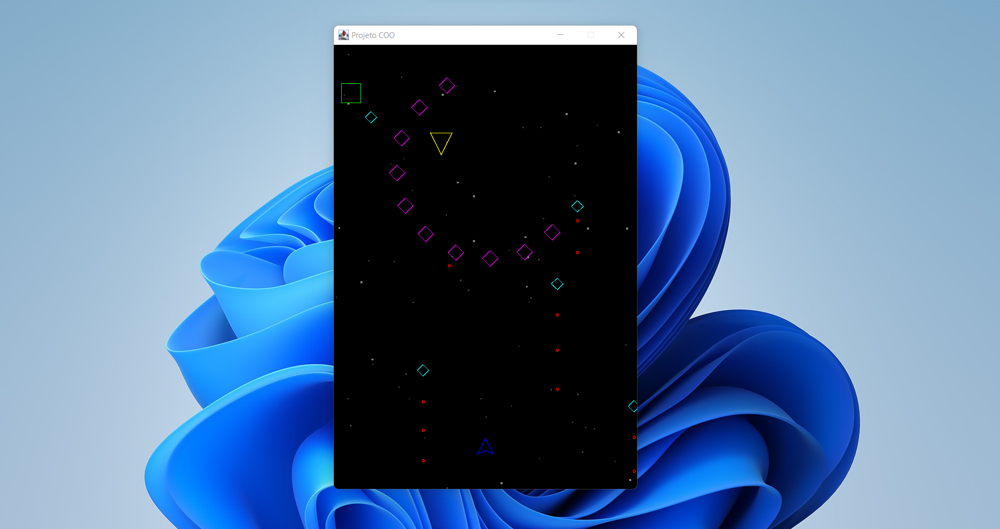

# shoot-em-up

O Shoot 'Em Up é um jogo clássico no qual o objetivo é eliminar os inimigos e manter a sua nave intacta. 

O projeto é fruto de um trabalho da disciplina de Computação Orientada a Objetos (ACH2003) da EACH-USP. Um código inicial do projeto foi entregue e o intuito era implementar boas práticas de programação orientada a objetos. Além disso, um tipo novo de inimigo foi incluído, assim como um *power up*.



### Tecnologias utilizadas

O projeto foi construído a linguagem de programação Java e conceitos de computação orientada a objetos como interfaces, objetos, herança, composição e polimorfismo.

### Executando o projeto

Inicialmente, deve-se compilar as classes utilizando:

```sh
javac Main.java
```

Em seguida, executa-se o projeto utilizando o seguinte comando:

```sh
java Main
```

